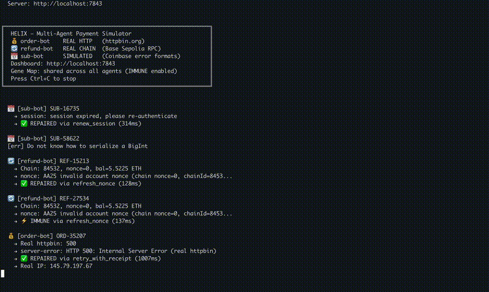

# Helix

[](https://www.npmjs.com/package/@helix-agent/core)
[](https://www.npmjs.com/package/@helix-agent/core)
[](#)
[](https://github.com/adrianhihi/helix/stargazers)
[](LICENSE)
[](https://pypi.org/project/helix-agent-sdk/)

**Self-healing runtime for autonomous agents. Fix once, immune forever.**

Your agent's API call failed. Helix diagnosed it, fixed it, and remembered. Next time — instant fix, zero cost. Think of stackoverflow + crowdstrike for agents.

```typescript
// Before: hope for the best
await agent.sendPayment(invoice);

// After: self-healing in one line
const safePay = wrap(agent.sendPayment.bind(agent), { mode: 'auto' });
await safePay(invoice);
```

---
**If this helped, please ⭐ — it helps us reach more developers.**
## How It Works

Helix wraps your function. When it fails, a 6-stage pipeline kicks in:

```
Error occurs → Perceive → Construct → Evaluate → Commit → Verify → Gene
                  │           │           │          │         │       │
            What broke?   Find fixes   Score them  Execute  Worked?  Remember
```

The fix is stored in the **Gene Map** — a SQLite knowledge base scored by reinforcement learning. Next time the same error hits any agent, it's fixed in under 1ms. No diagnosis, no LLM call, no cost.

## Quick Start

```bash
npm install @helix-agent/core
```

```typescript
import { wrap } from '@helix-agent/core';

// Wrap any async function — payments, API calls, anything
const safeCall = wrap(myFunction, { mode: 'auto' });
const result = await safeCall(args);

// Errors are automatically:
//   1. Diagnosed (what type of error?)
//   2. Fixed (modify params, retry with backoff, refresh token...)
//   3. Remembered (next time → instant fix)
```

## Demo




Three modes, three risk levels:

| Mode | Behavior | Risk |
|------|----------|------|
| `observe` | Diagnose only, never touch your call | Zero |
| `auto` | Diagnose + fix params + retry | Low — only changes how, never what |
| `full` | Auto + fund movement strategies | Medium |

## Powered by Vial

Helix is built on **[Vial](packages/vial-core/)** — a generic self-healing framework for any autonomous agent. Vial provides the PCEC engine, Gene Map, and all learning modules. Helix adds payment-specific adapters on top.

```
@vial/core              Generic self-healing engine
  ├── PCEC Engine        6-stage repair pipeline
  ├── Gene Map           SQLite knowledge base + RL scoring
  ├── Self-Refine        Iterative failure refinement
  ├── Meta-Learning      3 similar fixes → pattern → 4th is instant
  ├── Safety Verifier    7 pre-execution constraints
  ├── Self-Play          Autonomous error discovery
  ├── Federated Learning Privacy-preserving distributed RL
  └── Prompt Optimizer   LLM classification auto-improves

@helix-agent/core        Payment vertical (powered by Vial)
  ├── Coinbase           17 error patterns (CDP, ERC-4337, x402)
  ├── Tempo              13 error patterns (MPP, session, DEX)
  ├── Privy              7 error patterns (embedded wallet)
  └── Generic            3 error patterns (HTTP)

@vial/adapter-api        API vertical (powered by Vial)
  ├── Rate limits        429, throttle
  ├── Server errors      500, 502, 503, 504
  ├── Timeouts           ETIMEDOUT, socket, gateway
  ├── Connection         ECONNREFUSED, ECONNRESET, DNS
  ├── Auth               401, 403, expired token
  └── Client             400, 413, 422, parse errors
```

**Build your own adapter** — implement the `PlatformAdapter` interface for any domain:

```typescript
import { wrap } from '@vial/core';
import type { PlatformAdapter } from '@vial/core';

const myAdapter: PlatformAdapter = {
  name: 'my-service',
  perceive(error) {
    if (error.message.includes('rate limit'))
      return { code: 'rate-limited', category: 'throttle', strategy: 'backoff_retry' };
    return null;
  },
  getPatterns() { return [/* ... */]; },
};

const safeCall = wrap(myFunction, { adapter: myAdapter, mode: 'auto' });
```

## What Makes This Different

| | Sentry/Datadog | Simple retry | Helix |
|--|----------------|-------------|-------|
| Detects errors | ✅ | ❌ | ✅ |
| Fixes errors | ❌ | ⚠️ blind retry | ✅ smart fix |
| Learns from fixes | ❌ | ❌ | ✅ Gene Map |
| Cross-agent learning | ❌ | ❌ | ✅ Federated |
| Safety constraints | N/A | ❌ | ✅ 7 checks |

Sentry tells you something broke. **Helix fixes it.**

## Installation

**TypeScript/JavaScript:**
```bash
npm install @helix-agent/core
```

**Python:**
```bash
pip install helix-agent-sdk
```

**Docker:**
```bash
docker run -d -p 7842:7842 adrianhihi/helix-server
```

**REST API:**
```bash
curl -X POST http://localhost:7842/repair \
  -H 'Content-Type: application/json' \
  -d '{"error": "nonce too low", "platform": "coinbase"}'
```

## CLI

```bash
npx helix serve --port 7842          # Start server + dashboard
npx helix scan ./src                 # Scan codebase for error patterns
npx helix simulate "nonce too low"   # Dry-run diagnosis
npx helix self-play 10               # Autonomous error discovery
npx helix dream                      # Memory consolidation
npx helix discover                   # Find adapter gaps
```

## Architecture

Helix includes 15 learning and safety modules, all integrated into the core PCEC pipeline:

**Learning** — Gene Map (RL), Meta-Learning (few-shot), Causal Graph (prediction), Negative Knowledge (anti-patterns), Adaptive Weights (auto-tuning), Self-Play (exploration), Federated Learning (distributed), Gene Dream (memory consolidation), Prompt Optimizer (LLM self-improvement), Auto Strategy Generation (creates new fixes via LLM)

**Safety** — 7 pre-execution constraints (never modifies recipient or calldata), 4-layer adversarial defense (reputation, verification, anomaly detection, auto-rollback), cost ceilings, strategy allowlists

**Execution** — `refresh_nonce`, `speed_up` (gas × 1.3), `reduce_request` (value ÷ 2), `backoff_retry` (1s → 2s → 4s → 8s → 16s cap), `renew_session` (callback), `split_transaction`, `remove_and_resubmit`

## Self-Evolution

Helix doesn't just fix errors — it gets better over time:

```
Level 1: Data Evolution
  Every fix improves Q-values → better strategy selection

Level 2: Strategy Evolution  
  Meta-Learning spots patterns across fixes
  Self-Play discovers errors before users hit them
  Gene Dream consolidates knowledge during idle time

Level 3: Architecture Evolution
  Auto Strategy Generation invents new fix methods via LLM
  Adaptive Weights auto-tunes scoring per error category
  Auto Adapter Discovery detects when new platforms need support
```

## Stats

```
541+ tests across 3 packages
54 source files
Schema v12 (auto-migrating)
40+ payment error patterns
21 API error patterns
7 safety constraints
12 repair strategies
```

## Roadmap

- [x] **PCEC Engine** — 6-stage self-healing pipeline
- [x] **Gene Map** — SQLite + Q-value reinforcement learning
- [x] **Platform Adapters** — Coinbase, Tempo, Privy, Generic HTTP
- [x] **Self-Evolution** — Meta-Learning, Self-Play, Federated, Gene Dream
- [x] **Safety** — 7 constraints, adversarial defense, cost ceilings
- [x] **CI/CD Integration** — `npx helix scan` for GitHub Actions
- [x] **Vial Framework** — Generic core extracted (`@vial/core`)
- [x] **API Adapter** — Second vertical proving generic architecture
- [x] **Self-Refine** — Iterative failure reflection (paper: Self-Refine)
- [x] **Prompt Optimizer** — LLM classification auto-improves (paper: DSPy)
- [ ] **Executable Strategy Gen** — LLM generates runnable fix code (paper: DYSTIL)
- [ ] **CI/CD Adapter** — Third vertical: deploy failures, flaky tests
- [ ] **Gene Registry** — Shared knowledge across agents (network effect)
- [ ] **arXiv Paper** — "Vial: A Self-Evolving Repair Framework for Autonomous Agents"
- [ ] **PostgreSQL + pgvector** — Scale beyond SQLite

## Research

Helix implements ideas from these papers:

| Paper | What We Took | Module |
|-------|-------------|--------|
| [Reflexion](https://arxiv.org/abs/2303.11366) | Verbal reinforcement from failures | Negative Knowledge |
| [ExpeL](https://arxiv.org/abs/2308.10144) | Experience-conditioned strategy selection | Conditional Genes |
| [Voyager](https://arxiv.org/abs/2305.16291) | Skill library that grows over time | Auto Strategy Gen |
| [Self-Refine](https://arxiv.org/abs/2303.17651) | Iterative refinement with self-feedback | Self-Refine loop |
| [DSPy](https://arxiv.org/abs/2310.03714) | Self-improving LLM pipelines | Prompt Optimizer |
| [Mem0](https://arxiv.org/abs/2504.19413) | Scalable long-term memory | Gene Dream |

## Contributing

Contributions welcome. The easiest way to contribute is to write a new `PlatformAdapter` for a domain you care about.

```bash
git clone https://github.com/adrianhihi/helix
cd helix
npm install
npm run build
npm run test   # 541+ tests should pass
```

See [CONTRIBUTING.md](CONTRIBUTING.md) for guidelines.

## License

MIT

## Links

- [npm: @helix-agent/core](https://www.npmjs.com/package/@helix-agent/core)
- [PyPI: helix-agent-sdk](https://pypi.org/project/helix-agent-sdk/)
- [Docker: adrianhihi/helix-server](https://hub.docker.com/r/adrianhihi/helix-server)
- [awesome-mpp](https://github.com/mbeato/awesome-mpp) — Listed in the MPP ecosystem registry
